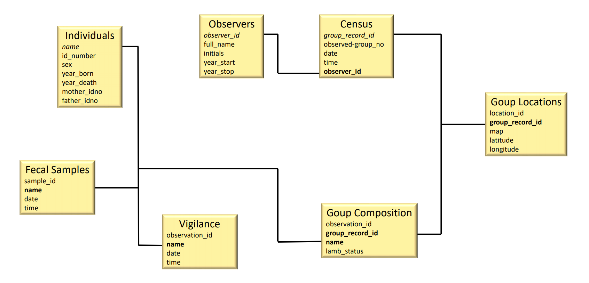

# Building the Database {#build}

This Markdown served as my submission for Assignment 6 in
WILD6900: Computational Tools for Reproducible Science
Professor: Dr. Simona Picardi. 
It is also an integral part of my final project.

In this document I will detail my project database.

```{r setup, include = TRUE}
knitr::opts_chunk$set(echo = TRUE, eval = TRUE)

#First, I will install and load packages.

#install.packages("RSQLite")
#install.packages("DBI")
library(DBI)
library(tidyverse)

#Then I will establish a database connection.

sheep <- dbConnect(drv = RSQLite::SQLite(), 
                   "../../../WILD6900_Comp-Tools/sheep.db")

```

## Database Design

Now that I have a database connection set up, I will build my database through tables in the structure based on the design below.

```{r layout, fig.cap="Database layout", fig.align='center', eval = TRUE, echo = FALSE, out.width='100%'}

```

## Building the Tables

Now I will create and fill my tables within the database, using the help of information from our class website:  <https://ecorepsci.github.io/reproducible-science/rsqlite.html>.


I will build a table via RSQLite for each table in my design.

```{r build tables, echo = TRUE, eval = FALSE}
#make table for individuals
dbExecute(sheep, "CREATE TABLE individuals (
name varchar(30) NOT NULL,
id_number varchar(8),
sex char(1),
year_born char(4),
year_death char(4),
mother_idno varchar(8),
father_idno varchar(8),
PRIMARY KEY (name)
);")

#Make table for Fecal Samples
dbExecute(sheep, "CREATE TABLE fecal (
sample_id varchar(10),
name varchar(30) NOT NULL,
date varchar(8),
time varchar(5),
FOREIGN KEY (name) REFERENCES individuals(name)
);")

#Make table for vigilance observations
dbExecute(sheep, "CREATE TABLE vigilance (
observation_id INTEGER PRIMARY KEY AUTOINCREMENT,
name varchar(30) NOT NULL,
date varchar(8),
time varchar(5),
FOREIGN KEY (name) REFERENCES individuals(name)
);")

#Make table for all observers
dbExecute(sheep, "CREATE TABLE observers (
observer_id INTEGER PRIMARY KEY AUTOINCREMENT,
full_name char(30),
initials char(3),
year_start integer(4),
year_stop integer(4)
);")

#Make table for census data
dbExecute(sheep, "CREATE TABLE census (
group_record_id INTEGER PRIMARY KEY AUTOINCREMENT,
observed_group_no varchar(3) NOT NULL,
date varchar(8),
time varchar(4),
obs_init char(3),
group_size integer(3)
);")

#Removed these for now until I can get more data for the observers table
#observer_id integer(3),
#FOREIGN KEY (observer_id) REFERENCES observers(observer_id)

#Make table for Group Locations
dbExecute(sheep, "CREATE TABLE group_locations (
location_id INTEGER PRIMARY KEY AUTOINCREMENT,
group_record_id INTEGER(6),
map varchar(10),
latitude varchar(8),
longitude varchar(8),
FOREIGN KEY (group_record_id) REFERENCES census(group_record_id)
);")

#Make table for Group Composition
dbExecute(sheep, "CREATE TABLE group_composition (
observation_id  INTEGER PRIMARY KEY AUTOINCREMENT,
group_record_id INTEGER(6),
name varchar(30),
lamb_status varchar(5),
FOREIGN KEY (group_record_id) REFERENCES census(group_record_id),
FOREIGN KEY (name) REFERENCES individuals(name)
);")

#Drop table if need to change
dbExecute(sheep, "DROP TABLE census");

```

## Importing Data

Now that I have all of my tables built, I will import my data into them.

```{r import data, echo = TRUE, eval = FALSE}
#Individuals ----
#Bring in data
individuals_ <- read.csv("../../tables/Individuals.csv")
head(individuals)
names(individuals_)[2] <- "id_number"

individuals <- individuals_ %>% 
  select(-X)

#Change names
names(individuals)[1] <- "X"
names(individuals)[4] <- "year_born"
names(individuals)[5] <- "year_death"
names(individuals)[7] <- "mother_idno"
names(individuals)[7] <- "father_idno"

#Fill table
dbWriteTable(sheep, "individuals", individuals, append = TRUE)

#Check that it worked
dbGetQuery(conn = sheep, 
           statement = "SELECT *
           FROM individuals
           LIMIT 10")

#Set connection
individuals <- dbGetQuery(sheep, "SELECT * FROM individuals;")


#Fecal ----
#Bring in data
fecal_full <- read.csv("../../tables/NBR Fecal Samples Fall 2019.csv")
head(fecal_full)
fecal <- fecal_full[ , c(5, 3, 1, 2)]

#Change names
names(fecal)[1] <- "sample_id"
names(fecal)[2] <- "name"
names(fecal)[3] <- "date"
names(fecal)[4] <- "time"
head(fecal)

#Fill table
dbWriteTable(sheep, "fecal", fecal, append = TRUE)

#Check that it worked
dbGetQuery(conn = sheep, 
           statement = "SELECT *
           FROM fecal
           LIMIT 10")

#Set connection
fecal <- dbGetQuery(sheep, "SELECT * FROM fecal;")

#Cen, loc, comp ----
#Bring in data to split for census, locations, and composition
BRCEN <- read.csv("../../Raw_Data/census_withLatLong_20200511.csv")
head(BRCEN)
names(BRCEN)

#Census ----
#subset for census table
census <- BRCEN[ , c(4, 3, 2, 14)]
head(census)

#Change names
names(census)[2] <- "observed_group_no"
names(census)[2] <- "time"
names(census)[5] <- "group_size"
names(census)[4] <- "obs_init"

#Fill table
dbWriteTable(sheep, "census", census, append = TRUE)

#Check that it worked
dbGetQuery(conn = sheep, 
           statement = "SELECT *
           FROM census
           LIMIT 10")
#Excellent.
#Now I need to do some wrangling to get it specific to the group
#I need to use it as a primary key in the next two tables.
library(tidyverse)

census <- BRCEN %>% 
  as_tibble() %>% 
  select(groupid, time, date, obs) %>% 
  group_by(date, groupid, time, obs) %>% 
  tally() %>% 
  mutate(grp_size = n) %>% 
  filter(!is.na(groupid)) %>% 
  select(-n)

#Set connection
census <- dbGetQuery(sheep, "SELECT * FROM census;")

#Locations ----
#Subset for group locations
locations <- BRCEN[ , c(18, 20, 19)]
head(locations)

#Change names
names(locations)[2] <- "latitude"
names(locations)[3] <- "longitude"

#Fill table
dbWriteTable(sheep, "group_locations", locations, append = TRUE)

#Check that it worked
dbGetQuery(conn = sheep, 
           statement = "SELECT *
           FROM group_locations
           LIMIT 10")

#Set connection
group_locations <- dbGetQuery(sheep, "SELECT * FROM locations;")

#Composition ----
#Subset for individuals in each group
names(BRCEN)
group_composition <- composition[ , c(5, 6)]

#Change names
names(composition)[5] <- "name"
names(composition)[6] <- "lamb_status"

#Rearrange to match census
composition <- BRCEN %>% 
  as_tibble() %>% 
  select(groupid, time, date, obs, fulltag_clean, lamb_present) %>% 
  group_by(date, groupid, time, obs)

#Fill table
dbWriteTable(sheep, "group_composition", group_composition, append = TRUE)

#Check that it worked
dbGetQuery(conn = sheep, 
           statement = "SELECT *
           FROM group_composition
           LIMIT 10")

#Set connection
group_composition <- dbGetQuery(sheep, "SELECT * FROM group_composition;")

#Need to go back through and solidify tables in db, specifically
#census to use it to build the locations table based on the unique
#group record id. composition needs this too.

```

This assignment shows my work flow for building my database and getting used to Rmarkdown. The assignment, along with my Assignment 7 bookdown, build to the final project.
